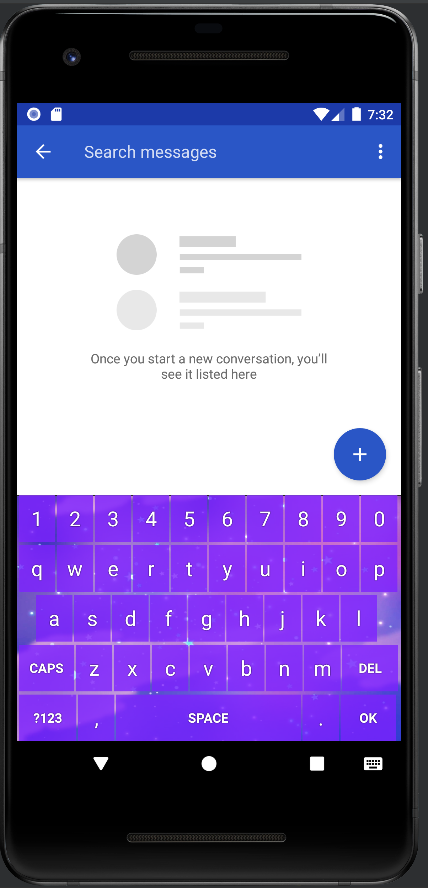

# Overview

This project consists in an Android keyboard service that aims to give and alternative to the standard Google Keyboard, with a colorful background and pitched sound upon letters press that resembles the speech from animals in the popular game franchise Animal Crossing.

# Install Guide

 - Dowloand and install the .apk through this link;
 - Be sure to grant install permission from unknown sources to your phone;
 - Go to settings and find the "Keyboard & Input" section
  - It may be different for each device the specific path to that info, but using the provided search bar should be fine enough
 - Activate the Keyboard;
 - Open a keyboard anywhere (like in messages) and click on the small button on the bottom-right corner of your device;
 - Enjoy :)
